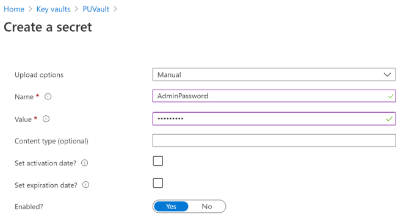
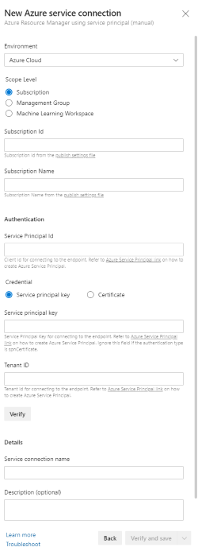
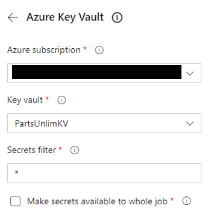

# Activate Azure with DevOps
## Module: End-to-End DevOps - Lab - Using Secrets from Azure Key Vault in a YAML Pipeline
### Student Lab Manual
**Conditions and Terms of Use**  
**Microsoft Confidential - For Internal Use Only**

This training package is proprietary and confidential and is intended only for uses described in the training materials. Content and software is provided to you under a Non-Disclosure Agreement and cannot be distributed. Copying or disclosing all or any portion of the content and/or software included in such packages is strictly prohibited.

The contents of this package are for informational and training purposes only and are provided "as is" without warranty of any kind, whether express or implied, including but not limited to the implied warranties of merchantability, fitness for a particular purpose, and non-infringement.

Training package content, including URLs and other Internet Web site references, is subject to change without notice. Because Microsoft must respond to changing market conditions, the content should not be interpreted to be a commitment on the part of Microsoft, and Microsoft cannot guarantee the accuracy of any information presented after the date of publication. Unless otherwise noted, the companies, organizations, products, domain names, e-mail addresses, logos, people, places, and events depicted herein are fictitious, and no association with any real company, organization, product, domain name, e-mail address, logo, person, place, or event is intended or should be inferred.

**Copyright and Trademarks**

© 2021 Microsoft Corporation. All rights reserved.

Microsoft may have patents, patent applications, trademarks, copyrights, or other intellectual property rights covering subject matter in this document. Except as expressly provided in written license agreement from Microsoft, the furnishing of this document does not give you any license to these patents, trademarks, copyrights, or other intellectual property.

Complying with all applicable copyright laws is the responsibility of the user. Without limiting the rights under copyright, no part of this document may be reproduced, stored in or introduced into a retrieval system, or transmitted in any form or by any means (electronic, mechanical, photocopying, recording, or otherwise), or for any purpose, without the express written permission of Microsoft Corporation.

For more information, see **Use of Microsoft Copyrighted Content** at [http://www.microsoft.com/about/legal/permissions/](http://www.microsoft.com/about/legal/permissions/)

Microsoft®, Internet Explorer®, and Windows® are either registered trademarks or trademarks of Microsoft Corporation in the United States and/or other countries. Other Microsoft products mentioned herein may be either registered trademarks or trademarks of Microsoft Corporation in the United States and/or other countries. All other trademarks are property of their respective owners.

## Contents  
[**Introduction**](#introduction)  
[**Prerequisites**](#prerequisites)  
[Task 1: Creating a service principal](#task-1-creating-a-service-principal)  
[Task 2: Creating a key vault](#task-2-creating-a-key-vault)  
[Task 3: Check the Azure Pipeline](#task-3-check-the-azure-pipeline)    

## Introduction 
Azure Key Vault helps teams to securely store and manage sensitive information such as keys, passwors, certificates, etc., in a centralized storage which are safeguarded by industry-standard algorithms, key lengths, and even hardware security modules. This prevents the disclosure of information through source code,  a common mistake that many developers make. Many developers leave confidential details such as database connection strings, passwords, private keys, etc., in their source code which when gained by malicious users can result in undesired consequences. Access to a key vault requires proper authentication and authorization and with RBAC, teams can have even fine granular control who has what permissions over the sensitive data.

## What’s covered in this lab
In this lab, you will see how you can use Azure Key Vault in a pipeline.

1. We will create a key vault, from the Azure portal, to store a SQL server password.
1. We will configure permissions to let a service principal to read the value.
1. We will retrieve the password in an Azure pipeline and passed on to subsequent tasks.

### Prerequisites

- Microsoft Azure subscription <https://azure.microsoft.com/>
- Lab MultiStage YAML Pipelines

**Estimated Time to Complete This Lab**  
30 minutes

### Task 1: Creating a service principal 

You will need a service principal to deploy an app to an Azure resource from Azure Pipelines. Since we are going to retrieve secrets in a pipeline, we will need to grant permission to the service when we create the key vault. 

A service principal is automatically created by Azure Pipeline when you connect to an Azure subscription from inside a pipeline definition or when you create a new service connection from the project settings page. You can also manually create the service principal from the portal or using Azure CLI,  and re-use it across projects. It is recommended that you use an existing service principal when you want to have a pre-defined set of permissions.

We will create one manually using the Azure CLI. If you do already have a service principal, you can skip this task.

1. Login to the [**Azure Portal**](https://portal.azure.com).

1. Open the Azure cloud shell. Select **Bash** when prompted to choose shell.

    

1. Enter the following command by replacing ServicePrincipalName with your desired value.

   `az ad sp create-for-rbac -n ServicePrincipalName `

   It will give you a JSON output as shown in the image. Copy the output to notepad or text file. You will need them later.

    

1. Enter the following command to get Azure SubscriptionID and copy the subscription ID and name to notepad.

    `az account show`

### Task  2: Creating a key vault

Next, we will create a key vault in Azure. For this lab scenario, we have an app that connects to an Azure SQL database. We will store the password for the Azure SQL database as a secret in the key vault.

1. If not already logged in, login to the [Azure Portal](https://portal.azure.com).

1. Enter "Key vault" in the search field and press enter. Select **Key Vaults** under services.

1. Select **New** or the **Create key vault** button to create a new key vault.

    

1. Provide a subscription, resource group, name, and location for the key vault. Additional fields can be left with their defaults.
    
    Note: You can use an exisiting resource group (including the previously created *PartsUnlimitedRG*) or create a new one

     
 
1. Since data in Key Vaults are sensitive and business critical, you need to secure access to your key vaults by allowing only authorized applications and users. To access the data from the vault, you will need to provide read (Get, List) permissions to the service principal that you will be using for authentication in the pipeline. Select **Access policy** and then select **+ Add Access Policy** to setup a new policy.

     

1. Next we will assign permission to the service principal created in Task 1. The principal can be identified by name or id. The permissions can be granted to manage keys and data(secrets). Applications can access the key vault in two ways:

    * User + Application access: Access is granted to specific user who can then be allowed to use any application or can be restricted to use a specific application. 

    * Application-only access: Access is granted to the application which can be run as a daemon service or background job.
    
    

1. Next, we will add the permissions to be granted to this principal. For now, we will provide **read-only** permissions (Get, List) to secrets only. Once Get and List are selected, click **Add** to return back to the *Create key vault* page. 

    

1. Click **Review + create** to begin validation and then select **Create** to create the vault.

1. It should only take a couple of minutes for the service to be created. Once it is provisioned, navigate to the key vault by selecting **Go to resource**. 

1. Navigate to **Settings | Secrets** 

     

1. Select **Generate/Import** to add a secret. 

     

1. The name of the secret will be **AdminPassword** to match the application. Provide any value that will be accepted as a password for an Azure SQL database.
    
        Requirements:
            * Minimum of 8 characters
            * Requires 3 out of 4 of the following:
                ** Lowercase characters
                ** Uppercase characters
                ** Numbers (0-9)
                ** Symbols
            * Cannot contain the login name

    
    

### Task 3: Check the Azure Pipeline

Now, lets go to the Azure DevOps project that you have been using for your YAML Pipeline Labs and configure Azure Pipelines to read the secret from the key vault.

1. Navigate to the Azure DevOps project.

1. Select **Project Settings** On the bottom left-hand corner of the page. Navigate to **Pipelines | Service Connections** on the Project Settings page

    

1. Select **New Service Connection** on the right

    

1. Choose *Azure Resource Manager* as the connection type then click Next

    

1. Choose *Service Principal (manual)* for the Authenication method the click Next

    

1. Fill in the information from the previously created service principal (Task 1). 

    * **Subscription Id and name:** Subscription ID and Name copied to notes from "az account show" command
    * **Service Principal Id** = AppId in the copied notes.
    * **Service Principal key** = Password in the copied notes.
    * **TenantId** = tenant in the copied notes.

    Click **Verify** to check it works, give the connection a name and click **Verify and Save**

    

1. Now, Select **Pipelines | Pipelines** from the left navigation bar.
    
    

1. Select and click on the YAML pipeline that was used in the YAML and Multi-stage YAML lab.  

    

1. From the menu on the right, select Edit.   

    

1. Find the **Deploy** stage in the YAML file and then find the first task, **Download Pipeline Artifacts**  

    

1. Place blank line after the download artifacts step. Try to leave an extra blank line in between tasks to make the pipeline easier to read. Search for **key vault** in the task search bar and select **Azure Key Vault**

    

1. Select the service connection you created in the previous steps for the **Azure Subscription** field

1. You can enter the name or select the key vault you created from the drop-down

1. In the **Secrets filter** field, you can specify an *asterisk* (*) to read all secrets or if you want only specific ones, you can provide the names of the secrets as comma-separated values. 

    

1. Select **Add** to add the task to the YAML file. Azure DevOps may report syntax errors, but the Pipeline will still run.

    

    At runtime, Azure Pipelines will fetch the latest values of the secrets and set them as task variables which can be consumed in the following tasks which means the password we stored earlier can be read using **$(AdminPassword)**.  

1. In the previous lab, we set the value of **AdminPassword** in the Pipeline varibles. We can now remove that variable. Select **Variables** in the top right corner. 

    Delete **AdminPassword** and save.

    

    While it is possible to set secret task variables specific and authorized only to a single pipeline, there can be security risks by embedding secrets directly in a pipeline definition. Any user belonging to the default Contributor role could have access to this information. In many cases, secrets are defined by security and/or operations teams that may not want to set this for every pipeline and need to ensure minimal exposure of secrets. Key Vault can address both of these challenges.

1. Save the YAML file and commit to master branch

    

1. Run the pipeline. Confirm the secret has been recieved by verifying a passing result for the Pipeline and checking all resources have been created in the Azure portal. 

### Exercise Challenge

Try creating a new secret to store the **ServerName** for the Azure SQL Database and change the pipeline to fetch and use the secret