# Activate Azure with DevOps
## Module: End-to-End DevOps - Lab - Multistage YAML Pipelines with Templates
### Student Lab Manual
**Conditions and Terms of Use**  
**Microsoft Confidential - For Internal Use Only**

This training package is proprietary and confidential and is intended only for uses described in the training materials. Content and software is provided to you under a Non-Disclosure Agreement and cannot be distributed. Copying or disclosing all or any portion of the content and/or software included in such packages is strictly prohibited.

The contents of this package are for informational and training purposes only and are provided "as is" without warranty of any kind, whether express or implied, including but not limited to the implied warranties of merchantability, fitness for a particular purpose, and non-infringement.

Training package content, including URLs and other Internet Web site references, is subject to change without notice. Because Microsoft must respond to changing market conditions, the content should not be interpreted to be a commitment on the part of Microsoft, and Microsoft cannot guarantee the accuracy of any information presented after the date of publication. Unless otherwise noted, the companies, organizations, products, domain names, e-mail addresses, logos, people, places, and events depicted herein are fictitious, and no association with any real company, organization, product, domain name, e-mail address, logo, person, place, or event is intended or should be inferred.

**Copyright and Trademarks**

© Microsoft Corporation. All rights reserved.

Microsoft may have patents, patent applications, trademarks, copyrights, or other intellectual property rights covering subject matter in this document. Except as expressly provided in written license agreement from Microsoft, the furnishing of this document does not give you any license to these patents, trademarks, copyrights, or other intellectual property.

Complying with all applicable copyright laws is the responsibility of the user. Without limiting the rights under copyright, no part of this document may be reproduced, stored in or introduced into a retrieval system, or transmitted in any form or by any means (electronic, mechanical, photocopying, recording, or otherwise), or for any purpose, without the express written permission of Microsoft Corporation.

For more information, see **Use of Microsoft Copyrighted Content** at [https://www.microsoft.com/en-us/legal/intellectualproperty/permissions/default](https://www.microsoft.com/en-us/legal/intellectualproperty/permissions/default)

Microsoft®, Internet Explorer®, and Windows® are either registered trademarks or trademarks of Microsoft Corporation in the United States and/or other countries. Other Microsoft products mentioned herein may be either registered trademarks or trademarks of Microsoft Corporation in the United States and/or other countries. All other trademarks are property of their respective owners.

## Contents
[**Introduction**](#introduction)  
[**Prerequisites**](#prerequisites)  
[Exercise 1: Initialize a Pipeline](#exercise-1-initialize-a-pipeline)  
[Exercise 2: Build a Template Stage](#exercise-2-build-a-template-stage)  
[Exercise 3: Create Template Parameters](#exercise-3-create-template-parameters)  
[Exercise 4: Organize the Pipeline Templates](#exercise-4-organize-the-pipeline-templates)  
[Exercise 5: Build a Job Template With a Pipeline Decorator](#exercise-5-build-a-job-template-with-a-pipeline-decorator)  
[Exercise 6: Build a Pipeline With Templates](#exercise-6-build-a-pipeline-with-templates)  

# **Lab: End-to-End DevOps: Deploy using Multi-Stage YAML with Templates**
## **Introduction**
In this lab, you will build and consume YAML templates to support modular pipelines. This can help reduce duplication, promote consistency and enforce best practices. 

You'll learn:
- Build reusable pipeline structures
- Consume a template from another YAML pipeline
- Template expansion with pipeline decorators

## **Prerequisites**  
- Lab 3.2 - Previous Multistage YAML Pipelines lab

**Estimated Time To Complete This Lab**  
45 minutes

## **Exercise 1: Initialize a Pipeline**  

In this lab, we will start by building reusable sections for other pipelines to consume. The idea is to provide a structure to support consistent, repeatable best practices in downstream pipelines. Azure Pipelines supports four kinds of templates.
* **Stage template** - Defines a set of stages in one file and use it multiple times in other files. This typically groups related jobs to support specific workflows like deploying resources to a target environment or running continuous integration with testing and security best practices baked in. 
* **Job template** - Defines a set of jobs in one file and use it multiple times in other files. This includes a collection of steps to be run on an agent.
* **Step template** - Defines a set of steps in one file and use it multiple times in another file.
* **Variable template** - Defines a set of variables in one file and use it multiple times in other files. This could be useful if you want to store variables in one file.

Templates themselves can include other templates to form complex structures. Azure Pipelines supports a maximum of 50 unique template files in a single pipeline. In this lab, we will focus on stage and job templates referenced in a single pipeline.

1. Navigate to [Azure DevOps](https://dev.azure.com/) and go to the project with the YAML Multi-Stage lab.

1. Navigate to **Pipelines**, then **Pipelines**.  
  
     

1. We will start by building reusable sections for other pipelines to consume. The idea is to provide a structure to support consistent, repeatable best practices in downstream pipelines. 

1. To start on the new template, select **New pipeline** to create a new pipeline.  

    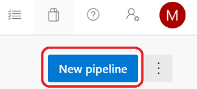

1. Select **Azure Repos Git** as the source.    

    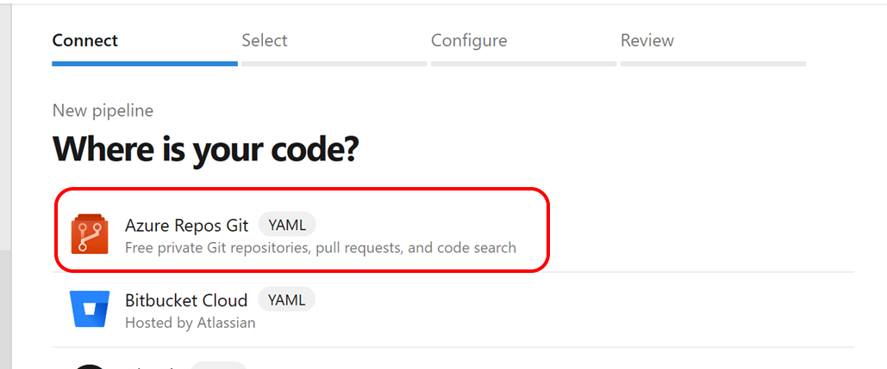

1. Next, select the **PartsUnlimited** repo.    

    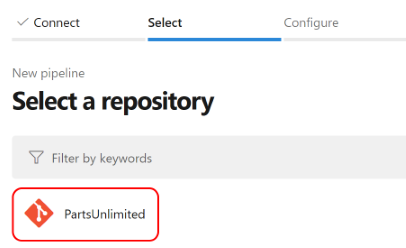

1. In the next screen, pick the Starter pipeline.

    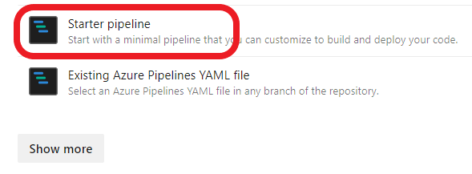

## **Exercise 2: Build a Template Stage**  

1. Rename the file from azure-pipelines-1 to stage_template by selecting the file name above the code.

    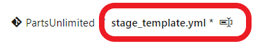

1. Delete the starter code. Update the yaml to include a stage and job as shown in the screenshot. As part of the job, add an environment called production.

    

    It is recommended to put your deployment steps in a [deployment job](https://docs.microsoft.com/en-us/azure/devops/pipelines/process/deployment-jobs?view=azure-devops) to run sequentially against a designated environment. This will provide benefits like capability to define a rollout strategy and audit deployment history across pipelines, resources and status reports.

1. Add a bash task to print a simple message to the logs.

    echo "Deploy Workload to production"

    

1. Add the **dependsOn** and **condition** properties to introduce a dependency on a stage called build. In this deploy stage, we would like to ensure that only successful builds are able to be deployed to our production environment.

    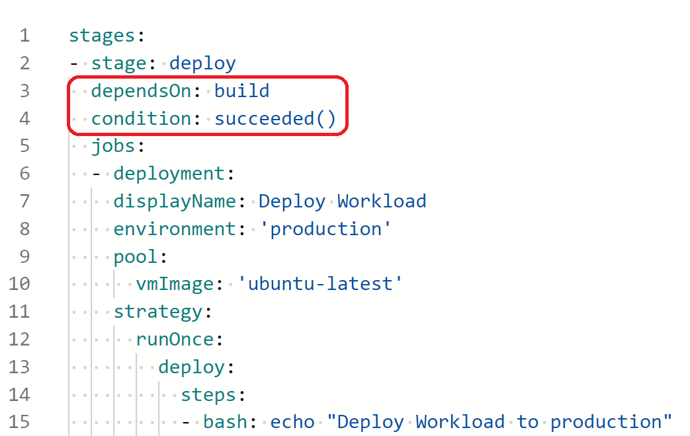

    Pipeline stages run sequentially in the order that they are defined. This can be used to support parallel runs and complex deployment strategies. More specifically, a stage will run if it does not depend on any other stage, or if all of the stages that it depends on have completed and succeeded. You can specify a [custom condition](https://docs.microsoft.com/en-us/azure/devops/pipelines/process/conditions?view=azure-devops&tabs=yaml) to support other workflows like forcing a stage to run even when a previous stage fails. 

1. Let's save our work. Click the drop down arrow and select **Save.** This will prompt a confirmation to commit directly to the default branch. It is recommended to save changes to a feature branch and approve default branch updates with a pull request. For brevity in this lab, we will preserve the defaults and select **Save** in the confirmation menu.

    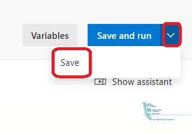

1. Once it's saved, we can continue making changes by selecting **Edit**.

    

## **Exercise 3: Create Template Parameters**  

In this exercise, we will introduce parameters to specify requirements in the template including type, default and enum. Runtime parameters are available during parsing and can bind values in a template. We will start with one parameter and reference the passed value in our template.

1. Add a parameter called **workloadName** of type string at the beginning of the YAML file.

    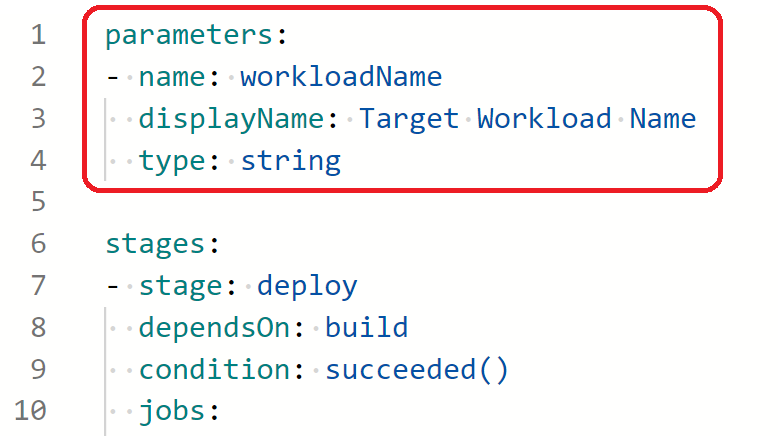

1. To add a default value for a parameter, add the **default** property and supply a workload name.

    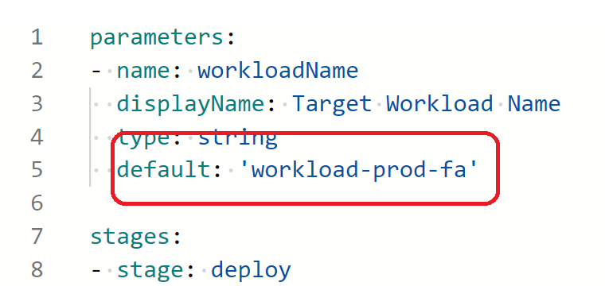

1. Next, we want to call the parameter in our template. In the job displayName and the bash task from earlier, replace **Workload** with our newly created parameter. To call a paramenter, enclose the parameter name with **${{ }}**.

    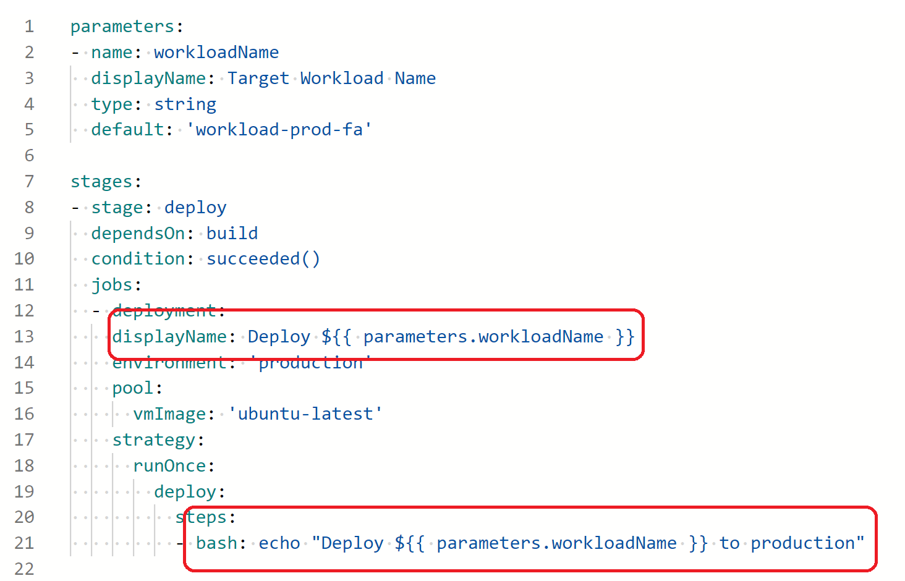

    When building YAML templates, be mindful that as templates are run they can access passed parameters, variables defined in the YAML, and many pre-defined variables. However, it will not have access to runtime variables like pipeline variables or others passed at runtime. Template expansion happens early in the run, so those variables aren't available.

1. Click **Save** and commit these changes to the default branch.

## **Exercise 4: Organize the Pipeline Templates**  

As more templates are built it's important to structure a repository effectively. Right now, we only have one but let's organize our repo to support job and stage templates.

1. In a new tab, navigate to the PartsUnlimited repository in Azure Repos. Then, add a folder at the root level called **pipelines** and also a file called **pipeline-readme.md** as a placeholder. Click **Create**.

    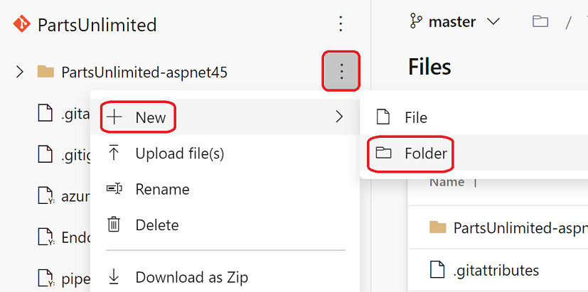
    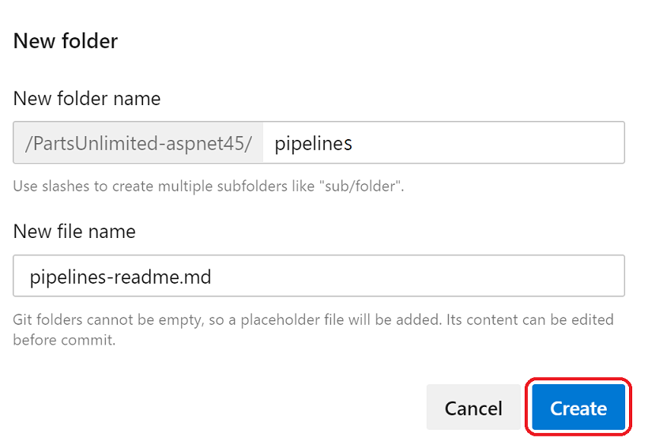

1. The new readme file should open up automatically. A readme is a good place to provide guidance around utilizing specific templates in downstream pipelines. For this lab, we will add "# Placeholder for best practices and usage" to the file, then **commit** the change to save the folder and readme.

    

1. Within the newly created pipelines folder, add another folder called **stage_templates** to create the structure **PartsUnlimited-aspnet45/pipelines/stage_templates** in the repo. Also create a file called **deployWorkload.yml**. Click **Create**.

    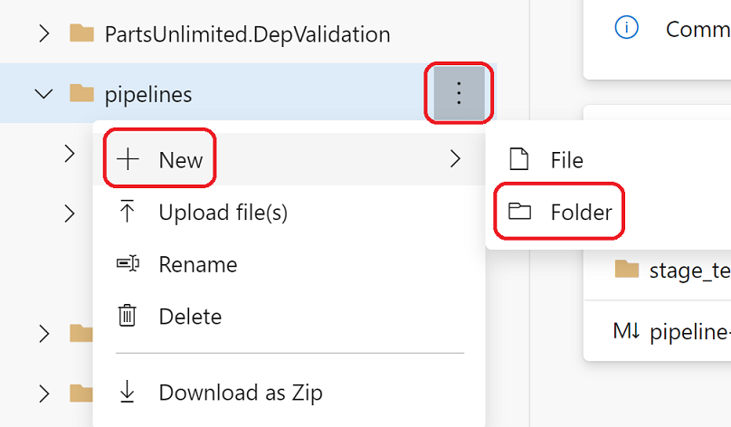
    
    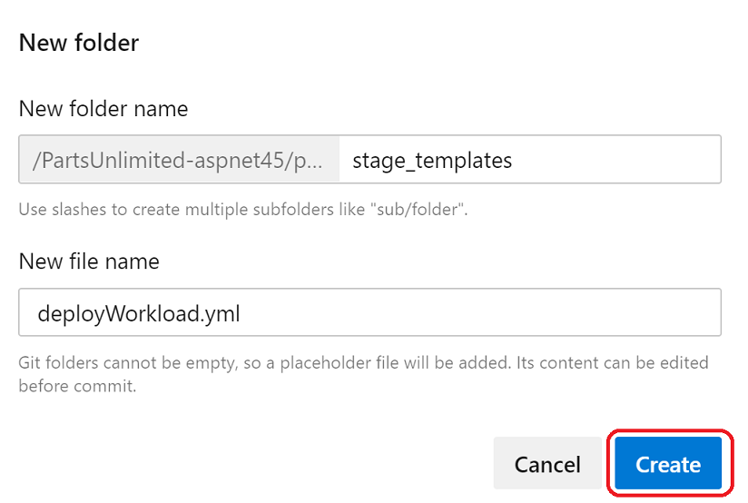

1. Copy the contents of our **stage_template.yml** and paste it into the **deployWorkload.yml** file. Click **commit** to save the changes to the repo.

    

1. Create one more folder called **job_templates** and a file called **build.yml** to create the structure **PartsUnlimited-aspnet45/pipelines/job_templates/build.yml** in the repo and **commit** the changes. The folder structure should now look like this:

    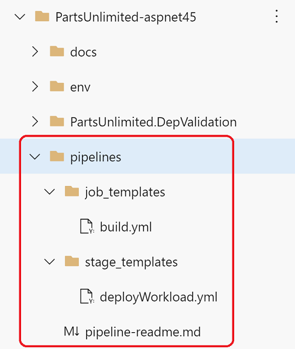

## **Exercise 5: Build a Job Template With a Pipeline Decorator**  

Next, we will create a second template with a build process that includes template parameters. This template will be an example of a job template.

1. Open the **build.yml** file that was created in the previous exercise. Click **Edit**.

    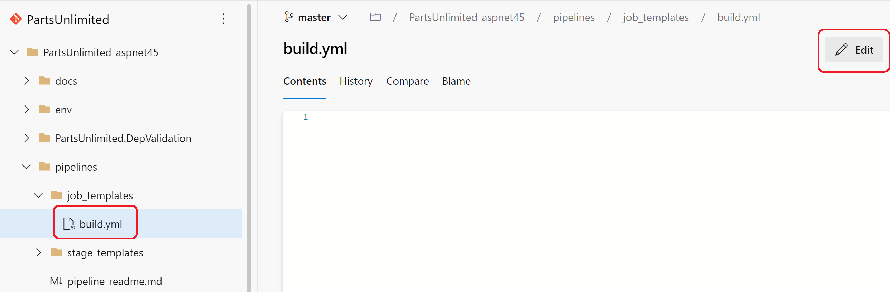

1. Add a **parameter** called **buildConfiguration**. This parameter conveys whether this is a build or release compilation. We are able to specify the type, default value, and enumerate valid values for each template parameter. Pipelines that try to feed this template invalid parameters will fail during template expansion. This means a pipeline would fail before running configurations that aren't in our allow list. 

    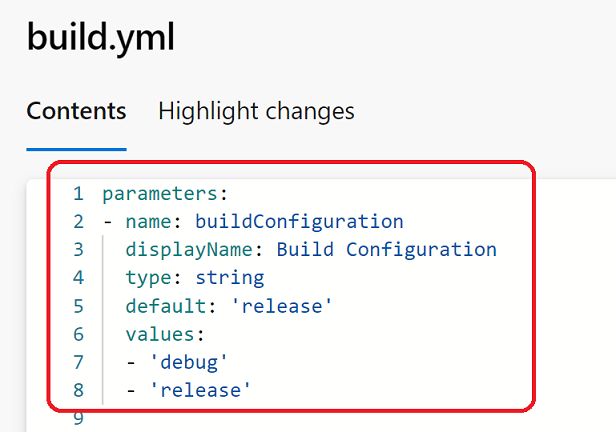

1. Add a second parameter called **preBuildSteps**. Using parameters and decorators, we can bake in best practices but give room for applications to complete custom workflows. Pipeline decorators allow you to add steps to the beginning and end of every job. This process is different than addings steps to a single pipeline because it can apply to multiple pipelines.

    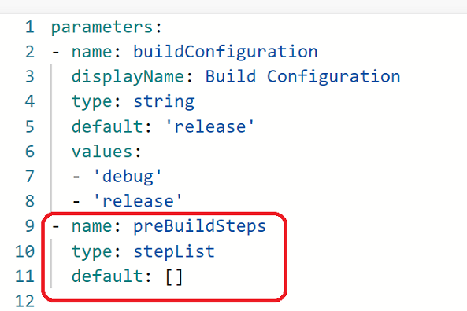

    The [pipeline decorator and conditional injection](https://docs.microsoft.com/en-us/azure/devops/extend/develop/add-pipeline-decorator?view=azure-devops#conditional-injection) can be combined in unique ways to ensure the right balance between autonomy and alignment. For example, you may want to specify a virus scanner to run on builds that may be released to the public.

1. Next, we need to add a job that will use the parameters we defined. Add a **jobs** section and create a job called **run_build**. Define the **pool** and add a section for the **steps**.

    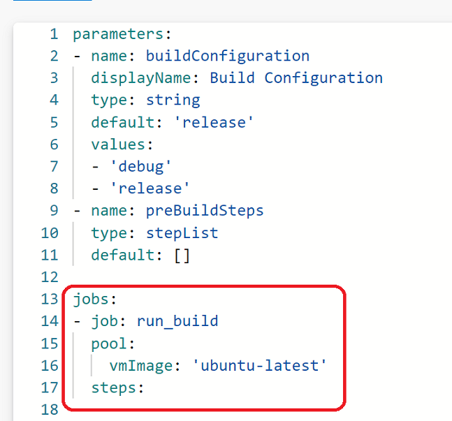

1. Now, call the **preBuildSteps** parameter. This will add all steps defined in the decorator. 

    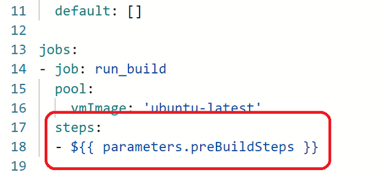

1. Lastly, add a bash task to print the build configuration to the logs. 

    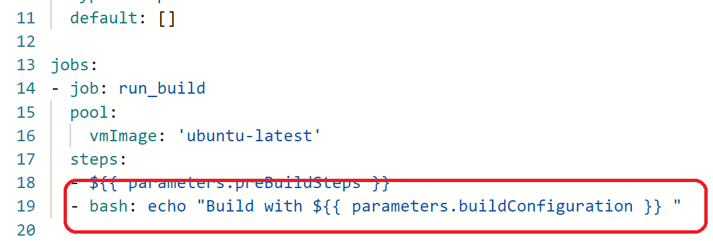

1. **Commit** the changes and save the YAML template.

## **Exercise 6: Build a Pipeline With Templates**  

1. With two templates ready for use, let's build a pipeline that leverages both of them. Rename the root level pipeline from **stage_template.yml** to **pipelinewithtemplates.yml**. **Commit** the changes.

    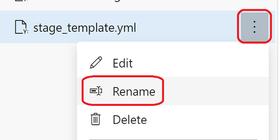

1. Next, we need to update the contents of the pipeline. Click **Edit** and remove the existing parameters and stages.

    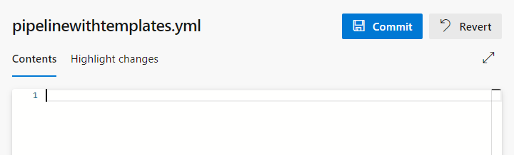

1. Add a stage called **build** and add the **template** property to call the build template we created in Exercise 5. This template is a job template so we are calling it within the **jobs** section.

    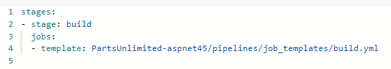

1. We want to ensure the build compiles using the release configuration. We can specify this by passing the parameter to the template. Add a second parameter for the preBuildSteps. If we don't supply the parameters, the default values will be used.

    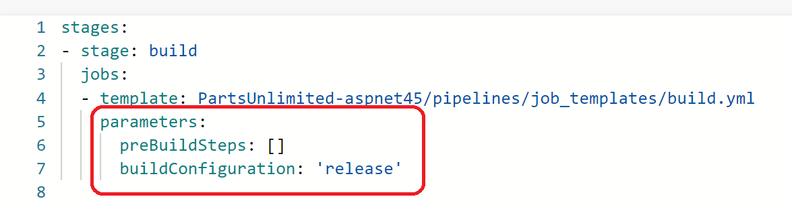

1. Next, we want to call our **deployWorkload.yml** template. Because this is a stage template, we can call it directly from the **stages** section without first defining a jobs section. Supply a value for the **workloadName** parameter.

    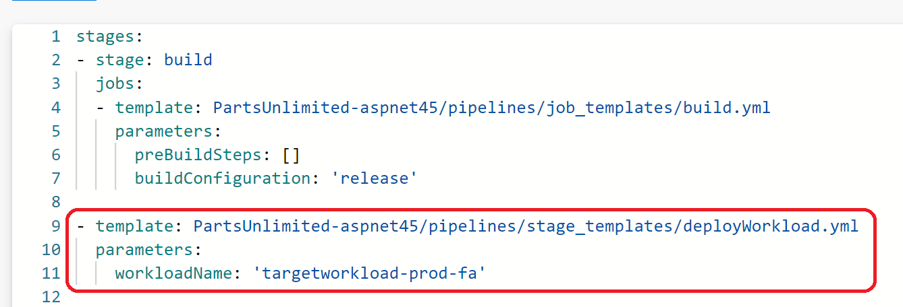

1. Add a second stage called **configure** that contains one job and one task. 

    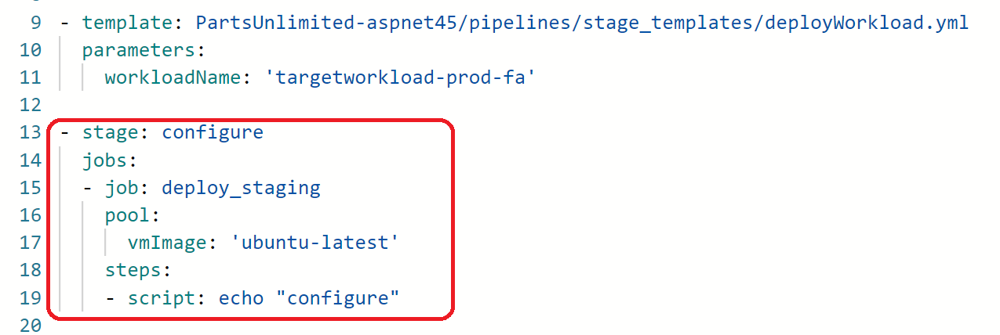

1. We want this configure stage to run only when the **deploy** stage defined in the **deployWorkload** template has completed. Add the **dependsOn** property to create this dependency.

    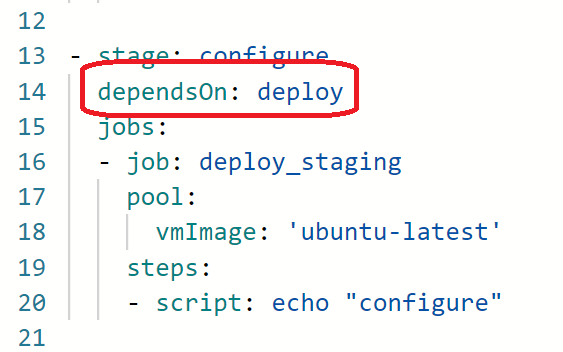

1. The pipeline is almost complete. Next, implement a trigger that supports batch CI updates from the default branch. Exclude content like the README file to optimize builds and speed up pipelines. 

    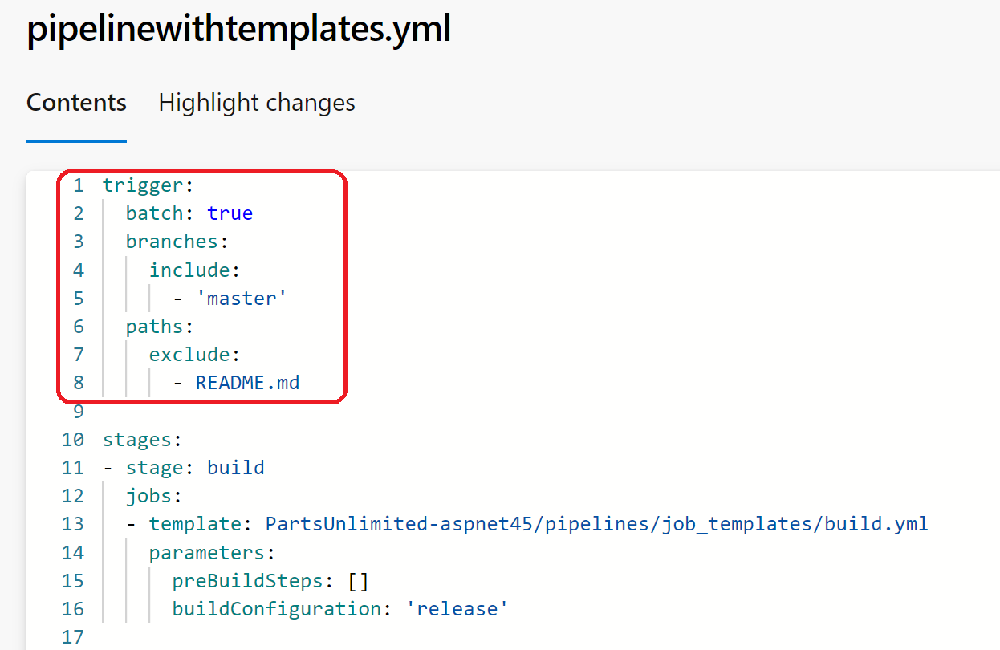

1. Define the build number format using predefined variables. This will ensure a unique build number each time the pipeline is queued.

    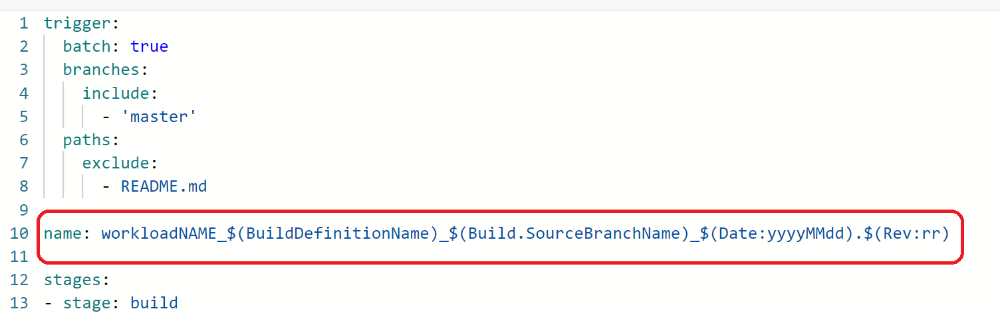

1. Review the pipeline and **Commit** the changes. 

    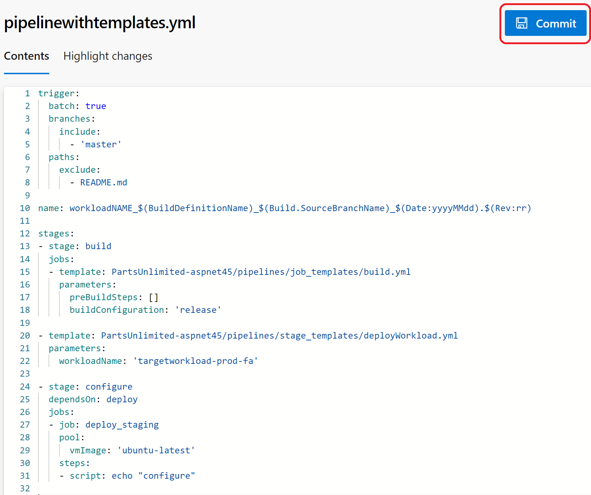

1. Navigate to the **pipeline** menu and choose the PartsUnlimited pipeline we created in Exercise 1. Because we renamed our YAML file, we need to relink the pipeline. Click on the **context** menu and choose **Settings**.

    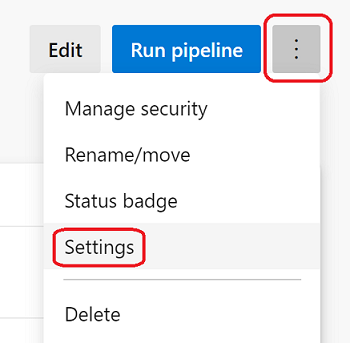

1. Update the file path and click **Save**.

    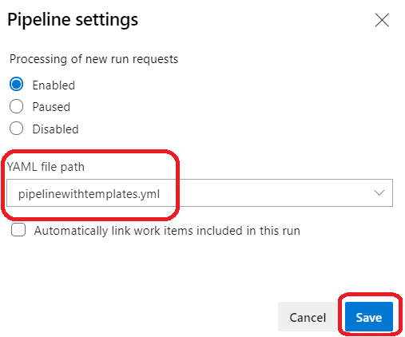

1. Click **Run Pipeline** to queue build and watch the logs as the pipeline executes.

    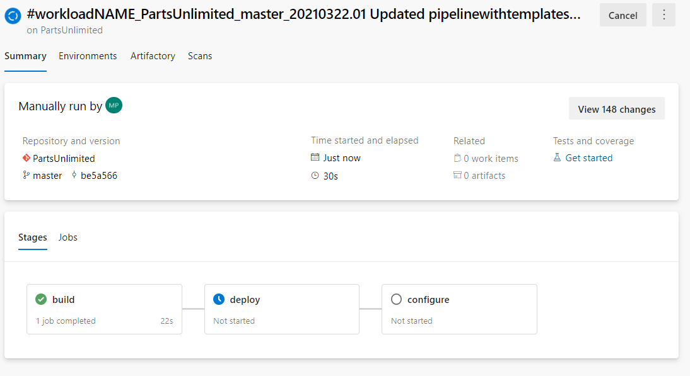

1. Click on the various stages to review the tasks and explore how the templates were consumed by the main pipeline.

    
